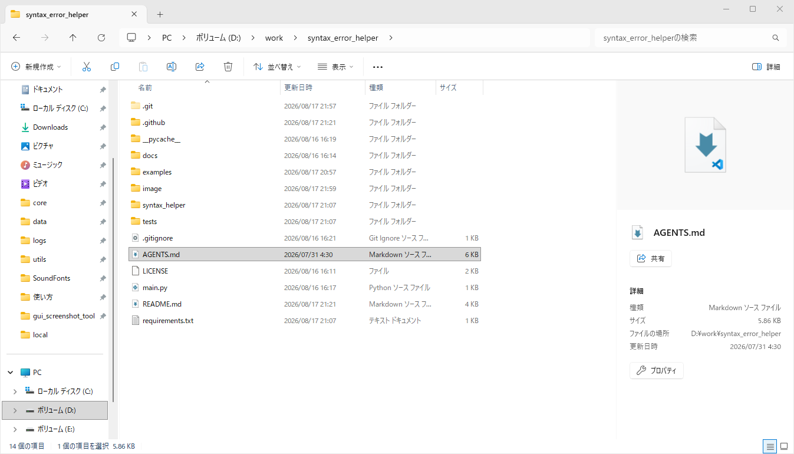

# 構文エラー解析ツール



[](https://github.com/rakima/syntax_error_helper/actions/workflows/test.yml)

プログラミング初心者が構文エラーの原因候補と直し方を、日本語で確認するためのデスクトップGUIツールです。パーサーが停止した行だけでなく、未閉鎖の括弧や直前行のセミコロン不足など、**実際の原因になった可能性が高い行**を推定して表示します。

画面左側でソースコードを編集し、右側で解析結果と修正候補を同時に確認できます。解析内容は薄い赤、修正候補は薄い緑で表示されるため、原因と直し方を見分けやすい構成です。左右の境界はドラッグして表示幅を変更できます。

## 対応言語

- C
- Java
- Python
- JSON

言語別解析器は分離されているため、将来ほかの言語を追加できます。

## 主な検出内容

- 共通: `()`、`[]`、`{}` の対応、文字列の閉じ忘れ、コメント・文字列内の括弧の除外
- C: セミコロン、制御文の閉じ括弧、`for` 内のセミコロン、文字・文字列・ブロックコメント
- Java: セミコロン、各種括弧、文字列・コメント、制御構文周辺
- Python: インデント、コロン、各種括弧、文字列、条件式の `=` と `==`
- JSON: 各種括弧、文字列、カンマ、コロン、引用符で囲まれていないキー

複数の候補がある場合はすべて表示します。左側のエディタでは、エラー発生行と原因候補行を薄い赤系の背景でハイライトします。右側では、問題位置・原因・理由を薄い赤、修正候補を薄い緑の背景で表示します。

## 必要環境

- Python 3.10以降
- Tkinter（通常のWindows版・macOS版Pythonには同梱）
- `tkinterdnd2` 0.6.2

依存パッケージをインストールします。

```powershell
python -m pip install -r requirements.txt
```

## 実行方法

リポジトリのルートで次を実行します。

```powershell
python main.py
```

1. 言語を選択します。
2. ソースコードを入力するか、対応ファイルをエディタへドラッグ＆ドロップします。
3. 「解析」を押します。
4. 左側のハイライト行と、右側の日本語による原因・理由・修正候補を確認します。

ドロップできる拡張子は `.c`、`.h`、`.java`、`.py`、`.json` です。ドロップ時は拡張子に合わせて言語が自動選択されます。UTF-8とCP932、2 MB以下のファイルに対応します。複数ファイルを同時にドロップした場合は最初の1ファイルを読み込みます。

すぐに動作を確認したい場合は、[`examples`](examples/README.md) にある各言語の正常例とエラー例をGUIへ貼り付けてください。

詳しい導入方法と操作説明は、[使い方.md](使い方.md)を参照してください。


## テスト

```powershell
python -m unittest discover -v
```

正常コード、典型的エラー、原因行と発覚行が異なるケース、コメント・文字列内の括弧、ネスト、複数候補をテストしています。

## Windows配布版のビルド

開発用依存パッケージをインストールし、PowerShellスクリプトを実行します。

```powershell
python -m pip install -r build-requirements.txt
.\build.ps1
```

`dist`フォルダーにWindows向け実行ファイルを含む配布フォルダーと、BOOTHへ登録できるZIPファイルが生成されます。購入者はPythonや追加パッケージをインストールする必要がありません。

## 注意事項

- 原因位置と修正候補は簡易構造解析とヒューリスティックによる**推定**であり、100%正しいとは限りません。
- このツールは入力されたコードを実行しません。標準ライブラリの構文解析と独自の字句・周辺解析だけを行います。
- C/Javaについてはコンパイラを呼び出さないため、初期版では初心者が遭遇しやすい典型的な構文ミスに対象を絞っています。

## 構成

```text
syntax_helper/
  model.py                 共通解析結果モデル
  scanner.py               コメント・文字列を考慮した共通構造解析
  service.py               GUIと解析器をつなぐサービス
  analyzers/               言語別解析器
  gui.py                   Tkinter GUI
tests/                     自動テスト
```
